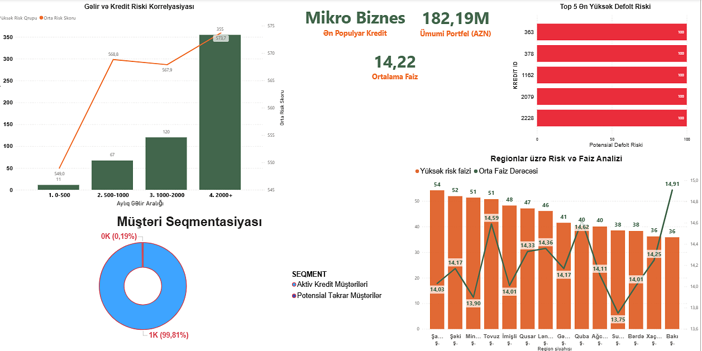

# 🏦 Credit Portfolio Performance Analysis

## 📌 Project Overview
This project analyzes a bank's credit portfolio to evaluate loan performance, identify default risks, and segment customers based on their repayment behavior. Using **Oracle SQL**, I processed complex datasets involving customer demographics, loan details, and payment histories to derive actionable business insights. The final results are visualized in a **Power BI Dashboard**.

## 📊 Dashboard Preview

*A snapshot of the Power BI dashboard showing key credit metrics and risk distribution.*

## 📂 Repository Contents
- **`data/`**: 📁 Contains the raw datasets (Excel/CSV) used for analysis (Customers, Loans, Payments, Credit Risk).
- **`CREDIT PORTFOLIO PERFORMANCE ANALYSIS.pdf`**: 📊 **The Full Analysis Report** (Visuals, Key Insights, and Business Recommendations). **<-- START HERE!**
- **`codes.sql`**: 💾 The complete SQL scripts used for data extraction, transformation, and KPI calculations.
- **`bank_credit_analysis.pbix`**: 📈 The original Power BI file for interactive exploration.

## 🎯 Key Business Problems Solved
The analysis focuses on answering critical business questions:
1.  **Portfolio Health:** What is the breakdown of loan types and overall interest rates?
2.  **Risk Assessment:** Which loans have a **100% delinquency rate**?
3.  **Regional Disparities:** Which regions have high risk despite low interest rates?
4.  **Customer Segmentation:** Who are the "Ideal Repeat Customers" vs. "High-Risk Borrowers"?
5.  **Income Paradox:** Does higher income guarantee better repayment behavior?

## 💡 Top Insights Discovered
- **Risk Paradox:** High-income earners (`2000+ AZN`) account for **~64%** of high-risk loans, suggesting over-leverage.
- **Retention Crisis:** Only **0.2%** of the customer base qualifies as "Ideal Repeat Customers", highlighting a major gap in customer retention strategies.
- **Critical Exposure:** Identified specific high-value loans with negligible principal repayment and immediate default signals.

## 🛠️ Tools & Technologies
- **SQL (Oracle)**: Joins, Aggregations, Window Functions, CASE Statements, CTEs.
- **Power BI**: Data Modeling, DAX, and Interactive Visualization.
- **Excel/CSV**: Raw Data Source.

---
*Feel free to explore the PDF report for detailed visualizations and the SQL file for the technical implementation.*

📧 **Contact:** [turan.hikmatqizi@email.com](mailto:turanhikmatqizi@gmail.com)
🔗 **LinkedIn:** [Turan Hikmatgizi](https://www.linkedin.com/in/turanhikmatgizi)
